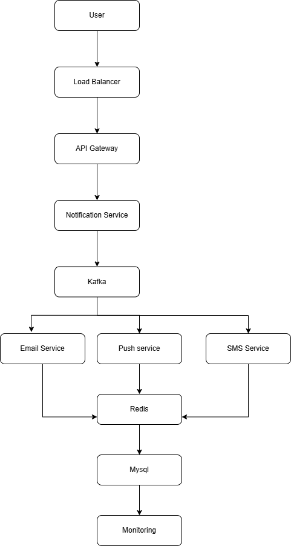
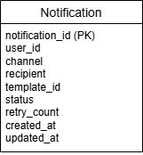

# Notification System (High-Level Design)

## Problem Statement

Design a highly scalable Notification System capable of sending Email, SMS, and Push Notifications to more than **100 million users**.

---

## Functional Requirements

- Send Email Notifications
- Send SMS Notifications
- Send Push Notifications
- Retry Failed Notifications
- Prevent Duplicate Notifications
- Track Notification Status

---

## Non-Functional Requirements

- High Availability
- Low Latency
- Scalability
- Fault Tolerance
- Reliable Delivery

---

## High-Level Architecture

### Components

- User
- Load Balancer
- API Gateway
- Notification Service
- Kafka
- Email Service
- SMS Service
- Push Service
- Redis
- MySQL
- Monitoring

---

## Database Design

---

## Request Flow

1. User sends a notification request.
2. The request reaches the API Gateway through the Load Balancer.
3. The Notification Service validates and stores the request.
4. The Notification Service publishes an event to Kafka.
5. Kafka delivers the event to the appropriate consumer.
6. Email/SMS/Push Service processes the notification asynchronously.
7. Notification status is updated in MySQL.
8. Monitoring tracks delivery status, failures, retries, and system health.

---

## Why Kafka?

Kafka enables asynchronous processing, allowing the API to respond quickly while notification delivery happens in the background. It also supports retries, fault tolerance, and independent scaling of consumers.

---

## Failure Handling

### Email Service Down

- Kafka retains the message.
- Consumer retries processing.
- After configured retries, the message is moved to a Dead Letter Topic (DLT).

### Kafka Down

- Store the notification using the Outbox Pattern.
- A background process publishes pending events when Kafka becomes available.

---

## Preventing Duplicate Notifications

Each notification has a unique **notification_id**.

Consumers process messages in an idempotent manner by checking whether the notification has already been processed before sending it.

---

## Scaling Strategy

- Increase Kafka partitions.
- Add more consumer instances.
- Scale Notification Service horizontally.
- Use Redis for caching templates and idempotency.
- Use MySQL replication for high availability.

---

## Monitoring

Monitor the following metrics:

- API Response Time
- Kafka Consumer Lag
- Failed Notifications
- Retry Count
- Service Health
- Dead Letter Topic Size

---

## Technologies

- Spring Boot
- Kafka
- Redis
- MySQL
- REST APIs
- Docker